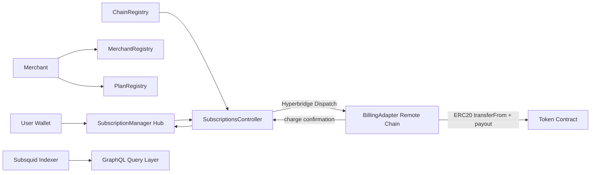

# Overview

Polkabill Protocol is a cross-chain recurring payment system focused on stablecoin
billing for digital APIs and services. It allows merchants to define subscription
plans onchain and collect recurring charges from users across supported chains,
while preserving wallet-native ownership and direct settlement.

The current implementation is production-oriented in architecture, with a clear split
between contract state management, cross-chain transport, execution adapters,
indexing, and developer SDKs.

## Motivation

Recurring digital payments are still largely dependent on cards and centralized
processors. That model introduces several problems for globally distributed
builders and users:

- users must rely on banking and card infrastructure
- merchants absorb processor fees and settlement friction
- privacy and censorship risks increase under centralized intermediaries
- cross-chain crypto-native recurring billing is hard to integrate safely

Polkabill solves this by giving merchants and users a direct wallet-based recurring
payment rail that supports cross-chain execution and straightforward integration
through SDKs.

## Architecture

Polkabill follows a Hub + Adapter architecture.

Repository roles:

- Hub contracts coordinate merchant, plan, subscription, and chain state:
  - ChainRegistry
  - MerchantRegistry
  - PlanRegistry
  - SubscriptionManager
  - SubscriptionsController
- BillingAdapter contracts execute remote-chain token movement and confirmation logic.
- packages/indexer persists lifecycle events into PostgreSQL and exposes query interfaces.
- packages/sdk-core and packages/sdk-react provide integration paths for applications.
- apps/dashboard provides the operational and merchant-facing frontend.

## Engineering Challenge(s)

Cross-chain payment systems naturally carry verification and transport latency.
Subscription billing, however, is expected to feel immediate and deterministic
to both users and merchants.

The central engineering dilemma is balancing:

- strict correctness and replay safety across chain boundaries
- fast and predictable recurring billing user experience

Polkabill addresses this by prioritizing deterministic execution semantics
(charge identity + state confirmation) while layering retry and timeout recovery
paths into the dispatch lifecycle.

## Design Decisions

The implementation separates concerns to keep critical billing logic verifiable:

- Hub-and-Adapter split keeps business state on the hub and payment execution on destination chains.
- Controller-driven message orchestration centralizes cross-chain dispatch and confirmation handling.
- Deterministic charge keys use (subscriptionId, billingCycle) to prevent duplicate processing.
- Registry-first activation ensures chains, adapters, and tokens are explicitly approved before usage.
- Billing windows plus grace periods ensure consistent charge eligibility behavior.
- Same-chain path executes locally, while cross-chain path uses Hyperbridge dispatch.

This reduces ambiguity in billing state while supporting multi-chain expansion.

## Reliability System

Reliability in Polkabill is built on state-machine controls and message-lifecycle safeguards:

- adapter-level idempotency map for executed charges
- controller-level processed confirmation map to block replay
- validation of source chain and adapter identity before acceptance
- timeout hooks with re-dispatch behavior for failed/late post requests
- strict subscription status progression (ACTIVE, DUE, CANCELLED) based on time windows
- observability via charge, relay, timeout, and failure events
- event persistence via Subsquid entities (Merchant, Plan, Subscription, Charge, Adapter, User, Payout)

Together, these choices reduce duplicate billing risk and improve recoverability
during cross-chain transport delays.

## Optimization

Polkabill is optimized for both execution and developer throughput:

- execution is wallet-native with direct contract calls via viem and wagmi
- integration is reduced to SDK usage through:
  - @polkabill/sdk-core
  - @polkabill/react
- monorepo packaging streamlines version alignment and release flow
- reusable contract ABIs and typed wrappers reduce integration errors

Operationally, the architecture also supports AI-assisted engineering workflows for
deployment checks, simulation, and debugging without storing sensitive user
credentials in protocol infrastructure.

## Security

Security controls exist at contract runtime and message-handling boundaries.

Smart contract and runtime safeguards include:

- access controls (owner/controller/hub/host-gated functions)
- reentrancy protection on critical cross-chain handlers
- safe token transfer patterns with SafeERC20
- adapter and token allowlisting per chain
- billing cycle validation before state advancement
- initialization guards for adapter setup

Cross-chain safeguards include:

- source chain validation for incoming messages
- adapter authenticity checks against chain registry
- duplicate charge and duplicate confirmation blocking
- timeout and failure signaling for operational response

# Logs And Benchmarking

Polkabill already emits lifecycle-rich events and persists them through
Subsquid, which enables historical analysis and near-real-time monitoring.

Planned benchmark reporting will compare:

- subscription setup and management flow against centralized processor experience
- cross-chain charge confirmation latency distributions
- integration effort using SDK-first approach vs custom direct contract integration
- operational cost profile (gas + messaging + adapter fee) against centralized billing alternatives

This benchmark layer will provide measurable evidence for ease of use and protocol efficiency.

# Integrations

Implemented integrations:

- Hyperbridge for active cross-chain messaging and dispatch
- Subsquid for indexing, persistence, and query-ready analytics

In-progress or planned integrations:

- Wormhole (dependency present in contracts package; active routing path not yet enabled)
- LayerZero (target interoperability direction; not currently active in runtime path)

# Summary

Polkabill Protocol is an active cross-chain recurring billing system
that turns wallet-native subscriptions into a practical merchant workflow.
The current system combines deterministic contract state transitions, adapter-based
payment execution, retry-aware cross-chain messaging, indexing for analytics,
and SDKs for easy integration.

The next major milestones are benchmark publication, deeper production telemetry, and broader multi-bridge interoperability.
