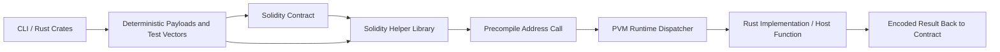

# Overview

PVM Precompiles is a developer tooling ecosystem for building against **revive runtime precompiles**.

It provides the SDKs, helper libraries, codecs, CLI tooling, and documentation needed to integrate native runtime functionality into Solidity applications without requiring developers to understand the underlying runtime byte layouts.

The repository demonstrates how runtime capabilities implemented in Rust can be surfaced as ergonomic Solidity APIs while preserving correctness, performance, and compatibility with pallet-revive.

Although the initial implementation focuses on cryptographic primitives such as BLS12-381 and Schnorr verification, the architecture is intentionally generic and is designed to support any runtime module that exposes functionality through Revive precompiles, including pallets such as XCM, Assets, Identity, Governance, and future protocol extensions.
PVM Precompiles is a developer tooling ecosystem for building against runtime precompiles

# Motivation

Cryptographic operations such as BLS12-381 point arithmetic,
multi-scalar multiplication, map-to-curve flows, pairing checks,
and Schnorr verification are expensive to reproduce in Solidity.
They are also difficult to encode correctly by hand, especially
when the contract interface, runtime codec, and test vector formats
all need to agree exactly.

This project solves that by providing:

- a Solidity library that hides low-level precompile address routing and byte encoding
- a CLI that generates valid test vectors, payloads, and expected outputs
- Rust crates that implement the encoding, decoding, and deterministic data generation logic

The intended end state is a broad, practical precompile access layer
for PVM contracts, with reusable tooling for testing and payload generation.

# Achitecture

The repository is organized as a three-layer developer stack:

Repository roles:

- `solidity/` contains the typed contract-facing helper libraries,
  reusable structs, example contracts, and deployment/test scripts.
- `pvm-cli/` contains the command line utility used to generate and
  validate inputs, outputs, and test data.
- `crates/` contains Rust implementations that handle encoding,
  decoding, vector generation, and local verification for
  Schnorr and BLS12-381.
- `doc/` contains architecture and workflow documentation for
  reviewers and contributors.

Runtime precompiles themselves live in the Polkadot SDK fork
under `pallet-revive`, while this repository provides the
developer-facing surface around them.

# Engineering Challenge(s)

The hardest part of the project is not calling the precompile.
It is showing the logic clearly enough that developers can trust
the call boundary.

The precompile logic already exists in the Polkadot SDK codebase,
but the user experience in Solidity depends on correctly mirroring
that runtime behavior:

- input bytes must match the runtime codec exactly
- curve points must be encoded and decoded consistently
- the Solidity layer must remain ergonomic without hiding validation failures
- test vectors need to be deterministic so contract tests can compare against fixed outputs

In practice, the challenge is to compress runtime complexity into
developer-friendly APIs without losing correctness or making the byte
layout opaque.

## Design Decisions

The design intentionally separates concerns instead of forcing
Solidity to reimplement crypto logic.

- The Solidity libraries are thin wrappers around precompile addresses,
  with typed helpers for common flows.
- The Rust crates own low-level encoding, decoding, and deterministic
  sample generation.
- The CLI acts as a bridge between raw precompile payloads and
  Solidity-friendly data shapes.
- Shared structs such as `G1Point`, `G2Point`, `G1MSM`, `G2MSM`,
  and `SchnorrSignature` make the contract and CLI representations align.

This keeps the contract interface stable while allowing the runtime
implementation to stay fast, native, and benchmarkable.

## Reliability System

The reliability model is based on pushing expensive computation into
native runtime precompiles instead of Solidity bytecode.

Key reliability properties:

- the runtime performs the cryptographic work directly
- the Solidity layer uses familiar structured inputs instead of ad hoc byte blobs
- the CLI and Rust crates enforce codec correctness before the data reaches a contract
- invalid lengths, malformed inputs, and mismatched array sizes are rejected early

The helper libraries also keep the data packing logic centralized.
That reduces the risk of divergent encodings across contracts,
scripts, and tests.

## Optimization

The system is optimized for lower execution cost and better
developer throughput.

- Runtime precompiles are faster and cheaper than equivalent Solidity computation.
- The helper libraries reduce repeated ABI and byte-packing logic in every contract.
- The CLI can be installed and used from any codebase to generate payloads and validate test data locally.
- The Rust crates provide reusable codecs and deterministic generators, which makes contract testing repeatable.

The project is also structured so that future direct-to-codec
Solidity helpers can be added if a contract needs tighter control
over payload construction.

## Security

Security is handled at both the runtime and smart contract layers.

- Runtime precompiles validate input lengths and structural correctness before running expensive operations.
- The Rust helpers check curve membership and subgroup validity where relevant.
- The Solidity wrappers surface mismatched-input conditions instead of silently producing bad payloads.
- The precompile boundary reduces attack surface compared with reimplementing cryptography in Solidity.

Because the logic sits close to the runtime, the main security
expectation is that contract inputs must still be treated as
untrusted. The helper libraries help enforce that discipline by
standardizing encoding and decoding rules.

## Logs And Benchmarking

Benchmark logging is planned as the next layer of evidence for
the precompile advantage.

The current codebase already supports payload validation,
deterministic test vectors, and local execution comparison.
The next step is to add benchmark output that compares:

- runtime precompile execution vs. equivalent Solidity computation
- payload size and packing differences
- gas or weight deltas across key operations

That will make the cost savings measurable rather than only theoretical.

## Integrations

Current and intended integrations include:

- Polkadot SDK `pallet-revive` runtime precompiles
- Solidity contracts and libraries for contract-side usage
- Rust CLI tooling for local generation and validation
- Hardhat-based scripts and example contracts in `solidity/`
- future parachain and contract integrations that want Revive-compatible cryptographic primitives

The project is designed to fit into existing smart contract workflows instead of requiring a custom toolchain.

## Summary

PVM Precompiles provides a practical bridge between native runtime
cryptography and Solidity contracts. The project focuses on three
things: making the precompiles easy to use, making the payloads easy
to trust, and making the developer workflow easy to repeat.

That combination is what turns a runtime capability into a usable developer product.
