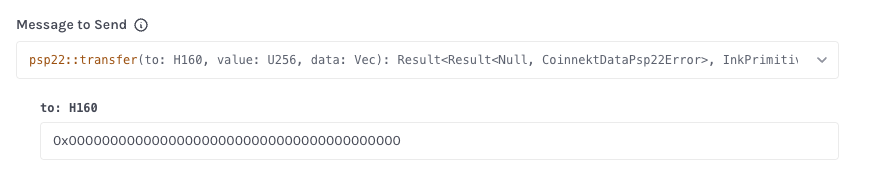
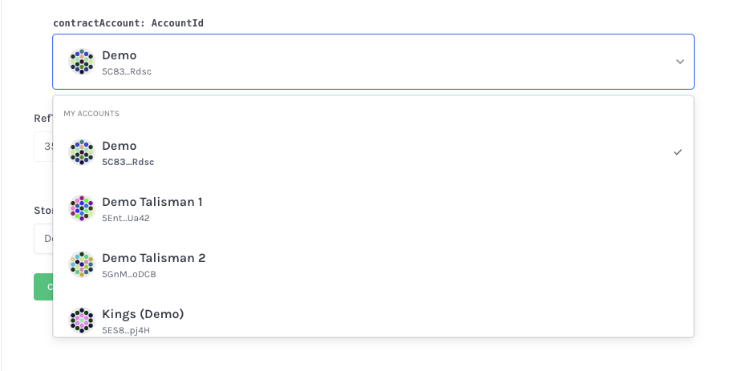
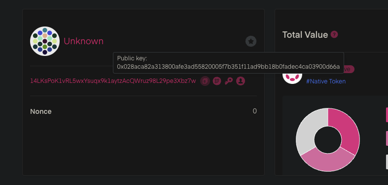
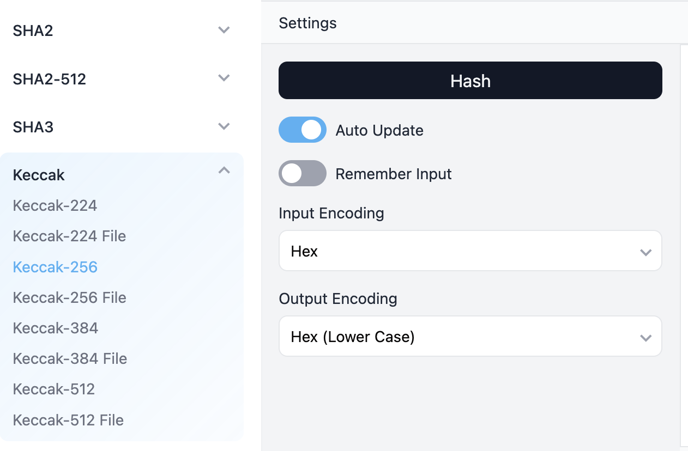
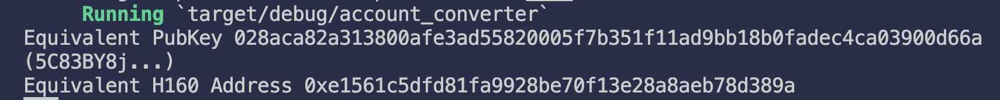

## Introduction


Ink! V6, is a major turnaround on how Substrate chains interpret deployed Smart contract code. Compared to earlier versions, V6 is not exactly the same in terms of how the code is compiled and interacts with the host Substrate chains. One of the major directions Polkadot is taking in terms of interoperability and developer support, culminates to support for the largest Blockchain developer community, Solidity programming. 


With V6, ink! smart contracts (written in Rust) are able to directly talk to Solidity contracts, something like a cross-contract call. To allow for this cross ecosystem communication, ink! V6 has an improved account system that allows more sophisticated representation of Blockchain accounts. Prior versions of Ink! would deploy smart contracts and give a Substrate-based (or chain dependent). V6, on the other hand introduces new type to represent an AccountID allowing direct support for EVM-based addresses (which are 20 bytes long).


With new changes come new problems and one introduced by the V6 update has to do with passing a H160 account to a smart contract call. For visual comparisons, these two extrinsic  receive an address as one of its arguments. [Contracts UI](https://github.com/use-ink/contracts-ui/issues/582) provides a dropdown to select your address (for AccountID), but expects a 32 bytes hex as the address but no dropdown is provided for the type of H160. Obtaining this account type is not intuitive either, but this guide will show you how can get through this, until this bug is resolved.








## Why Introduce H160 Account Type


The address type H160 is an EVM-based format of addresses. It starts with 0x and is followed by 20 bytes of hexadecimal characters. This format is useful to allow ink! contracts to directly interact with Solidity contracts, allow the ink contracts to receive tokens (and messages) from EVM-based accounts. While the original AccountId is still supported (for Substrate based representations), the new H160 type is also added (to represent EVM-based accounts). Internally, the ink contract automatically converts a Substrate based account to its equivalent H160 account using 1 round of Keccak256 and prefixing the last 20 bytes with _0x_. 

There are online tools to do this, and there’s also programs that can be written for this conversion. For the Frontend ecosystem, it’s assumed that Wallets will abstract this conversion for Users but it’s also possible to use JS script to do the conversion. (by using the PolkadotJS library)  One other very simple trick is to add a debug function to the smart contract and allow the message to return the H160 equivalent of the function caller. To list out the conversion approaches

1. Use online solutions comprising of at least 3 steps
    1. Search for your Substrate account on [Polkadot subscan](https://polkadot.subscan.io/) and locate the Public key

        


    b. Paste the copied public key to this online [Keccak256 hasher](https://emn178.github.io/online-tools/keccak_256.html) and be sure to set the Input encoding to Hex as shown below


    


    c. Copy the last 20 bytes of the Output and this is the equivalent H160 account that can be used in any EVM-based transaction

1. Write a basic script that takes an account and converts it into the equivalent H160 account
2. Use Polkadot API
3. Include a dedicated message that returns the H160 account of the env().caller().

## Technical Implementation


It is very straightforward to use an Online tool to handle this logic but it’s also possible to implement the logic for the conversion using Rust logic. Substrate offers a number of crates that can help with this conversion and the most crucial ones are [sp_runtime](https://docs.rs/sp-runtime/latest/sp_runtime/struct.AccountId32.html) and [sp_core](https://docs.rs/sp-core/latest/sp_core/) crates.


To get started, create a new Rust binary using `cargo new account_converter` . Open the `main.rs` file and add the following lines of code


```rust
1 use sp_runtime::AccountId32;
2 use sp_core::{crypto::Ss58Codec, keccak_256, H160};

4 fn ss58_to_pubkey(address: &str) -> Result<AccountId32, &'static str> {
5    let account_id: AccountId32 = AccountId32::from_ss58check(address)
6         .map_err(|_| "Invalid SS58 Address")?;
7     Ok(account_id)
8 }

10 fn keccak_hash_pubkey(pubkey: &AccountId32) -> Result<H160, &'static str> {
11   let digest = keccak_256(pubkey.as_ref());
12    // last 20 bytes is the H160
13    Ok(H160::from_slice(&digest[12..]))
14 }

16 fn main() {
17    let address = "SS58_WALLET_ADDRESS";

19    let pubkey = match ss58_to_pubkey(address) {
20        Ok(pk) => pk,
21        Err(e) => {
22            eprintln!("Error: {}", e);
23            return;
24        }
25    };
26    println!("Equivalent PubKey {:?}", pubkey);

28    let h160_address = match keccak_hash_pubkey(&pubkey) {
29        Ok(addr) => addr,
30        Err(e) => {
31            eprintln!("Error: {}", e);
32            return;
33        }
34    };
35    println!("Equivalent H160 Address {:?}", h160_address);
36 }
```


We start by importing the required types and functions. sp_runtime exposes the struct `AccountId32` (32 bytes hex string)  as the public key and sp_core hosts some core Substrate types such as H160 and Ss58Codec (must exist to be able to use some of the implemented functions of AccountId32).


Line 4 defines a function `ss58_to_pubkey` which is responsible for converting our SS58 address to its Pubkey equivalent. You can copy your wallet address and pass into this function. It is expected to return a 32 bytes string, if the provided address is valid. The pubkey returned can then be hashed using the Keccak256 hash from sp_core. Line 13 truncates the hash result to the last 20 bytes and that is the resulting H160 account. If everything is setup properly, you should see the following displayed in your terminal after running the `main.rs` file.





For Frontend implementations where Users must provide the H160 account type to an extrinsic, Polkadot API can help with getting the pubkey and the subsequent steps are pretty much the same thing. Given the SS58 account (usually gotten from an Injected provider), the pubkey can be gotten using 


`const pubKey = keyring.decodeAddress(ss58Address); // returns Uint8Array of 32 bytes`


Then, take the resulting pubkey and hash it to a 32 byte hex using keccak256 as described below


```typescript
import { decodeAddress } from "@polkadot/util-crypto";
import { keccakAsU8a } from "@polkadot/util-crypto";
import { u8aToHex } from "@polkadot/util";

function substrateToEthereumAddress(ss58: string): string {
  // 1. Decode the SS58 to public key (Uint8Array of 32 bytes)
  const publicKey = decodeAddress(ss58);

  // 2. Hash it with keccak256
  const keccakHash = keccakAsU8a(publicKey);

  // 3. Ethereum address is last 20 bytes
  const ethAddress = keccakHash.slice(-20);

  // 4. Return hex string
  return u8aToHex(ethAddress);
}
```


With the above code, we can easily generate the H160 address and use in our functions.


## Conclusion


While the introduction of a H160 address type is a very useful addition to the ink! contract environment and allows much higher level of interoperability, the existing tooling are not fully equipped to interpret the corresponding types and can cause a bit of a headache for unfamiliar users. While DevEx is still catching up to the new V6 changes, Developers might find themselves required to do some things the manual way, or confused on how to handle the new types.


For the H160 - SS58 addresses, the most effective way would be to manually do the conversion between formats to allow for the smart contract to decode appropriately.
