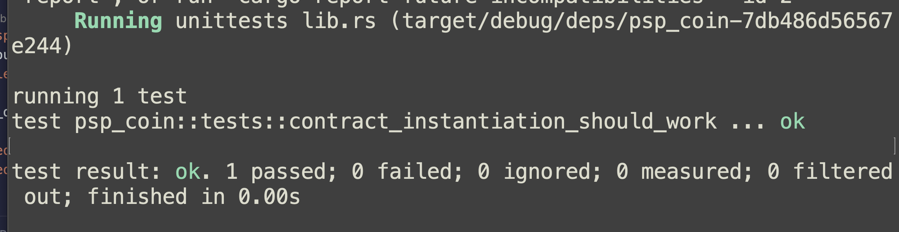
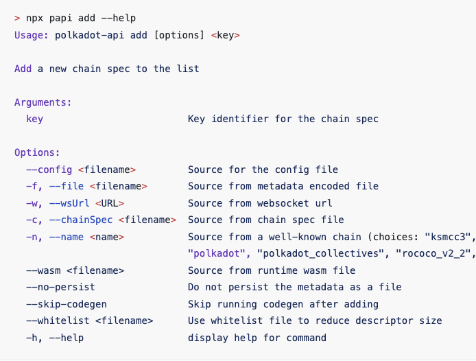
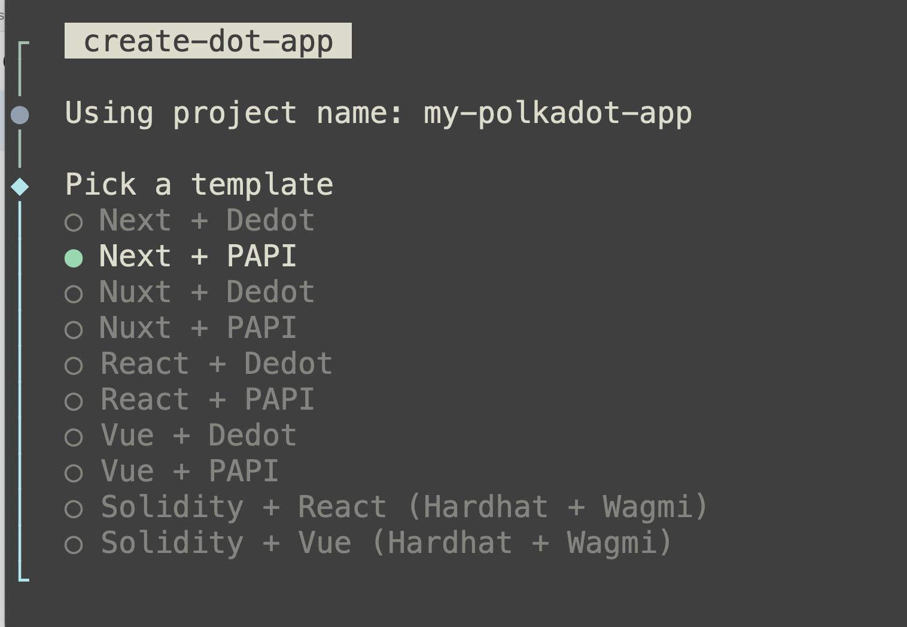
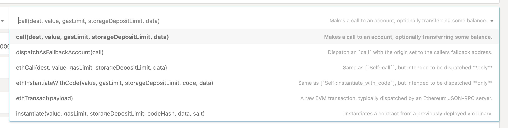

## [Cross-contract Calls in ink!](/27fc5f3533eb80dfadf9d5463caa9b87)

- Implementing on-chain cross-contract calls in ink! smart contracts
    - Different approaches to cross-contract call (on same chain)
    - Contract references
- Implementing on-chain cross-consensus calls in ink! smart contracts

## Day 5

## Ink! Developer Workshop - _Web3bridge Edition_


### Objectives

- Understand how to do Unit testing on ink! contracts
- Getting familiar with ink_env::test crate
- Implementing some unit tests and mock on-chain scenario
- Testing dispatched events
- Introducing ink-e2e testing
- Unit testing compiled smart contracts
- Write e2e tests for compiled contracts

# Ink! Unit Testing Introduction


Unit tests are very vital when it comes to smart contract development. Ideally, writing a smart contract should be test-driven (write tests first, then build smart contract to pass the tests). In a large team, the requirements come first and these can be used to build test suites. Then when the contract is successfully tested and compiled, a E2E test can then be used to test all full functionalities


Ink! Unit testing works the same as normal Rust unit tests, to enable existing Rust engineers to work well with it. The major differences are, the unit tests must be declared within the contract module (inside the _`#[ink::contract]`_ ) and each test function is marked with an _`#[ink::test]`_ macro. 


```rust
#[ink::contract]
mod contract {
	
	#[cfg(test)]
	mod tests { 
		use super::*;  // import all from super
	}
}
```


Once we got this setup, we can then define our test cases, an example unit test for the constructor (new) can be written as follows:


```rust
#[ink::test]
#[should_panic()]
fn contract_instantiation_works() {
	// Instantiate expects a total supply
	let total_supply = U256::from(1000);
	let instance = ContractInstance::new_with_supply(total_supply);
	
	assert_eq!(instance.total_supply, total_supply, "Total supply must match the instantiated");
}
```





# Mocking on-chain scenario in Unit tests


A very important part of unit testing a s,art contract has to do with mocking on-chain conditions. For example, 

- Some functions can only be called by the deployer (or an approved list of wallets)
- Some messages have different results based on the block number
- Some contract actions might rely on the timestamp.
- and so on and on

Understanding how to simulate these conditions is very vital to ensure successful and well-covered unit tests. 


**How do we do these?**


Fortunately, [ink_env](https://docs.rs/ink_env/6.0.0-alpha/ink_env/index.html) is a crate that exposes a lot of functions that can be used for these exact use-cases (so we don’t need to rebuild them from scratch). Some of the most commonly used ones from the crate documentation are listed below:

1. _**set_caller**_: simulate the caller for the next transaction (can also be used to set the deployer).
2. _**default_accounts**_: returns a list of (test) wallet addresses that can be used to make calls and interact with contract. The wallets are alice, bob, charlie, e.t.c
3. _**set_value_transferred**_: Sets the value transferred from the caller to the callee as part of the call
4. _**advance_block**_: advances the chain by a single block
5. _**set_block_number**_: Sets the block number to a certain block.

These are the most used for ink contracts, depending on use-case. The full list of functions can be found [here](https://docs.rs/ink_env/6.0.0-alpha/ink_env/test/index.html#functions).


# Unit testing demo


We can write our unit tests for our PSP22 contract. To test, for instance, the transfer function, this is what the code might look like.


```rust
#[cfg(test)]    
mod tests {        
	use ink::env::test::{default_accounts, set_caller};
  use super::*;
        
  #[ink::test]        
  fn contract_instantiation_should_work() {            
	  let alice = default_accounts().alice;            
	  set_caller(alice);            
	  let supply: U256 = U256::from(1_000u64);            
	  let contract = PspCoin::new_with_supply(supply);
            
    assert_eq!(contract.total_supply(), supply, "Supply must match instantiation supply");            
    assert_eq!(contract.balance_of(alice), contract.total_supply(), "Alice must have all the total supply");        
  }
  
  #[ink::test]        
  fn calling_transfer_from_should_work() {            
	  let alice = default_accounts().alice;            
	  let bob = default_accounts().bob;            
	  let eve = default_accounts().eve;
            
    let supply = U256::from(1_000u64);            
    set_caller(alice);            
    let mut pspcoin = PspCoin::new_with_supply(supply);
            
    set_caller(bob);            
    let result = pspcoin.transfer_from(alice, eve, U256::from(10), [].to_vec());            
    assert!(result.is_err(), "Should not transfer without allowance");
            
    // let alice grant allowance to bob            
    set_caller(alice);            
    let result = pspcoin.approve(bob, U256::from(30));            
    assert!(result.is_ok(), "Approve should work");
            
    // bob can now transfer on behalf of alice            
    set_caller(bob);            
    let result = pspcoin.transfer_from(alice, eve, U256::from(10), [].to_vec());            
    assert!(result.is_ok(), "TransferFrom should work");            
    assert_eq!(pspcoin.balance_of(eve), U256::from(10), "Eve should have 10 tokens");            
    assert_eq!(pspcoin.balance_of(alice), U256::from(990), "Alice should have 990 tokens");            
    assert_eq!(pspcoin.allowance(alice, bob), U256::from(20), "Bob should have allowance of 20 tokens");        
  }    
}
```


# Ink! E2E Testing


E2E testing is full suite testing that can be done in an ink! contract environment. This involves testing the whole flow of the smart contract functionalities, against an ephemeral node. Every run of the e2e test is run against a fresh node instance.


To start with, there are 2 important things we need to do here

1. Upload a particular contract to the node to get the code hash
2. Instantiate a particular contract to the node, to get the AccountId

To upload a contract on-chain (and get the code has), we can use the client exposed by the ink_e2e environment and call its upload function. To define e2e tests within an ink! contract, the code can be defined as below


```rust
#[cfg(all(test, feature = "e2e-tests"))]
mod e2e_tests {
	use super::*;
	
	type E2EResult<T> = std::result::Result<T, Box<dyn std::error::Error>>;
	
	#[ink_e2e::test]
	async fn instantiate_contracts_for_e2e<Client: E2EBackend>
	(mut client: Client) -> E2EResult<()> { .. }
}
```


From above code, the new parts introduced are the Result type and the [type of Client](https://docs.rs/ink_e2e/6.0.0-alpha/ink_e2e/trait.E2EBackend.html). Tests marked with the _`#[ink_e2e::test]`_ expect a response type of type Result as defined above. The ink_e2e environment will automatically inject the client into the function (and we only need to specify the type). Under the hood, the E2EBackend uses the ink! `DefaultEnvironment` and this can be seen on the documentation.


# Uploading & Instantiating the Smart contract


We need to upload/instantiate our contracts (depending on the use-case) before we can interact with it in the e2e environment. Both of these can be achieved using the injected `client`.


**Uploading a Contract**


To upload a contract, we need the contract_name as well a Keypair. The Keypair is available on the ink_e2e crate, which we can import into the e2e module. The code below can help with the uploading,


```rust
let upload_result = client
	.upload("contract_name", &ink_e2e::alice())  // contract_name of the contract
	.submit()   // Submit the transaction on-chain
	.await    // Instantiation is async, so we need to await
	.expect("Error message in case instantiation fails");
	
println!("The deployed contract's code hash: {:?}", upload_result.code_hash);

/**
** The type pof the upload result
pub struct UploadResult<E: Environment, EventLog> {
    pub code_hash: H256,
    pub dry_run: CodeUploadResult<E::Balance>,
    pub events: EventLog,
}
**/
```


**Instantiating a contract**


Instantiating on the other hand, will actually return the account ID because the code gets deployed to the node. Instantiation can be done in the following steps;

1. Generate the constructor function
2. Use a keypair with the contract name

Code example is below:


```rust
// Get the constructor, this does not instantiate the contract
let constructor = ContractRef::new(775648, address);

// Instantiate using the client::instantiate
let contract = client
	.instantiate("contract_name", &ink_e2e::bob(), &mut constructor)
	.submit()
	.await
	.expect("Instantation Error Message");
```


# **Sending messages and queries in E2E**


Once we have our instantiated contract, we can then proceed to send messages (or query its state). Both approaches work in similar ways. We need to use the CallBuilder API to then interact with the contract


```rust
// Once we have the contract instance
let mut builder = contract.call_builder::<ContractInstance>();
let call = builder.flip();   /// Setup the function "flip" on the contract

let result = client.call(&ink_e2e::alice(), &call)   // Perform the call
	.submit()
	.await
	.expect("Call Error Message")
	.return_value();    // Get the return value
```


Once we have our e2e tests setup, we can run it using the commands:


`cargo contract test --features e2e-tests` 


Or if we’re using pop CLI
`pop test --e2e`


# Resources

- The ink environment [[_`ink_env`_](https://docs.rs/ink_env/6.0.0-alpha/ink_env/index.html)] crate.  It’s automatically available once ink is added to the project

_`ink = { git = "https://github.com/use-ink/ink", tag = "v6.0.0-alpha.4", version = "6.0.0-alpha.4", default-features = false, features = ["unstable-hostfn"] }`_

- Ink! E2E testing crate [[_`ink_e2e`_](https://docs.rs/ink_e2e/latest/ink_e2e/)].

`ink_e2e = { git = "https://github.com/use-ink/ink", tag = "v6.0.0-alpha.4", version = "6.0.0-alpha.4" }`


- [_`Ink Testing documentation`_](https://use.ink/docs/v6/contract-testing/overview)
- [Polkadot JS explorer](https://polkadot.js.org/apps/#/extrinsics)
- [Pop CLI codebase](https://github.com/r0gue-io/pop-cli) and online [ink! documentation](https://learn.onpop.io/contracts/welcome/migrating-to-inkv6)

## Day 6&7

## Ink! Developer Workshop - _Web3bridge Edition_


### **Objectives**

- Introduce Polkadot API library for ink! integration
- Implementing wallet connect on Frontends
- Demo vite:papi:react → ink! smart contract interaction
- Query smart contract
- Sending messages
- Events

# Slide 2: What is Polkadot API?


Frontend Typescript library for interacting with substrate chains and the smart contracts deployed onto them as well. Polkadot API, commonly called _**PAPI,**_ is an npm library and can be installed using the following command:


```rust
npm i polkadot-api
```


PAPI provides a number of primitive that helps a Typescript/NodeJS D’app to connect with a Substrate (consequently, a Smart contract) chain. There are multiple ways to connect to a chain but we will focus on the JSON-RPC Provider (& Websocket Provider). Once we have this provider, we can easily connect to a chain using:


```rust
import { createClient } from "polkadot-api";
import { getWsProvider } from "polkadot-api/ws-provider/node";

const client = createClient(
	getWsProvider("wss://testnet-passet-hub.polkadot.io")
);
```


PAPI, by default, exposes a **`polkadot-api/ink`**module that can be used to interact with smart contracts on a low-level. This is exported automatically from the normal polkadot-api library and needs no further installation. It can be useful for querying and performing dry-run operations on a smart contract. There is also an ink! specific library that can be installed using:


`npm i @polkadot-api/sdk-ink` . 


This library is a high-level implementation that abstracts a number of redundancy from the Frontend developer and also provides better handling and interactions. 
This slides demos the low-level approach and compares it with the _`sdk-ink`__._


# Connecting to a Wallet


To perform transactions (write messages that update storage), it is necessary to have a signer available and this is exactly what browser wallets offer us. We have to start with connecting to our wallets. The available wallets to use are:

- [Polkadot JS Signer](https://polkadot.js.org/extension/)
- [Talisman Wallet](https://talisman.xyz/)
- [Subwallet](https://www.subwallet.app/download.html)
- [Nova Wallet](https://novawallet.io/) (mobile wallet)

We can use a helper library to connect to our wallets. A very popular and useful library is the **`@talismn/connect-wallets`** library. This can be installed using 


`npm install @talismn/connect-wallets` 


This library exposes a **`getWallets`** helper function that returns a list of all compatible wallets (and accounts). To connect to a wallet, for example, we can write a function that looks like:


```typescript
const installedWallets = getWallets().filter(({ installed }) => installed);

const connect = async (wallet: Wallet) => {
	try {
		await wallet.enable("DAPP_NAME");
		const accounts = await wallet.getAccounts();
		
		if (accounts) {
			setAccountsList(accounts);
		}
		setAccount[accounts[0])
		setWallet(wallet);
	} catch {
		setAccount(null)
	}
}

// Each account contains
// address, name, source, type

// Disconnecting just needs clearing all set states
const disconnect = () => {
if (wallet) {
	setActiveWallet(null)
	setAccounts([])
	setAccount(undefined)
}
```


# Interacting with a chain


The Provider derived above is enough to connect to a chain but to interact with the same chain, it’s necessary to know about the storage, runtime, available extrinsics and other types defined on the chain.


Installing PAPI using the install command defined above also exposes a CLI tool that can be used to add a chain and generate metadata for the chain. 





Once the code is generated, it will be available in the _`node_modules`_ of your project under _`@polkadot-api/descriptors`_ _._ The generated types can then be brought into the frontend using the using the helper function exposed by PAPI


```rust
const typedApi = client.getTypedApi(passet);
```


The Typed API returned by `getTypedAPi` is enough information to be able to derive all typed information about a chain, such:

- Constants - `typedAPi.constants.<pallet_name>.<constant>`
- Runtime APIs: `typedAPi.apis.<api>.<function>`
- Transactions: `typedAPi.tx.<pallet>.<extrinsic>`

These and others are to show that every function of the chain is exposed from these approaches


# Interacting with an Ink! Contract


Polkadot-API also add typescript definitions for ink! contracts, as wella s helper functions to codec messages, storage and even events. WHile it’s necessary to install `polkadot-api` and follow the guides as described above, to add ink! support, we also need to bring in _`polkadot-api/ink`_ which is the library that supports ink! types. This is a much low-level library that can be used to interact with ink! and is automatically available on polkadot-api.


The Steps to interacting with a contract are to get access to the smart contract. Assume you have a compiled and working smart contract, 

1. We need to add the chains we want to work with, for passetHub

    ```bash
    npx papi add -w wss://testnet-passet-hub.polkadot.io passet
    ```

2. Generate the smart contract type definitions using the contract’s metadata

    ```bash
    npx papi ink add "../path_to_contract.metadata" # .contract | .json file
    ```


Once we have these 2 setup, the added chain is integrated into the code as we described in abo steps and the generated smart contract types are all available in a `.papi` folder at the root of our project.


# Instantiating the Smart Contract


We proceed in our code by creating the ink! client as descibed in the example below, (using our example PSP coin):


```typescript
import { getInkClient } from "polkadot-api/ink";
import { contracts } from "p@olkadot-ai/descriptors";

const client = initializeCLient();   // From our previous code
const inkClient = getInkClient(contracts.psp_coin);  // uses contract name
```


Using this `inkClient` we can begin to interact with our _`psp_coin`_ contract. For example, to deploy a smart contract we can get the uploaded wasm bytes and call the Revive API that a normal on-chain deployer would call.


```typescript
const deployNewToken = useCallback(async (account: WalletAccount) => {    
	const pspHashResponse = await fetch("../../path_to.polkavm");    
	const pspBuffer = await pspHashResponse.arrayBuffer();    
	const pspCodeHash = Binary.fromBytes(new Uint8Array(pspBuffer));    
	
  const constructor = inkClient.constructor("new_with_supply");    
  const constructorArgs = constructor.encode({        
	  owner: Binary.fromHex(convertSS58toHex(account.address)),        
	  total_supply: [15653200n, 0n, 0n, 0n],    
  });
  const response = await typedApi.apis.ReviveApi.instantiate(        
	  account.address,        
	  0n, // endowment        
	  undefined, // gas limit (optional)        
	  undefined, // storage deposit limit        
	  Enum("Existing", pspCodeHash), // code hash        
	  constructorArgs, // encoded constructor args        
	  undefined, // salt (optional)    
  )    
  if (response.result.success) {        
	  const contractAddress = response.result.value.addr;        
    const responseMsg = constructor.decode(response.result.value.result);        
    console.log("Deployed response:", responseMsg);    
  } else {        
	  console.error("Error deploying contract:", response);    
  }  
}, [client, initializeClient]);
```


# Calling Smart Contract Functions


We can also interact with already deployed smart contract, which is pretty much the use-case we always want to go for. Say we already deployed a smart contract to passetHub, with 


```typescript
const CONTRACT_ADDRESS = "0xC139114BB0199171a12b39ba4a0A818eF637F840";

/// It is possible to call functions of the contract after getting the inkCLient
/// As well as the typedApi for the deployment chain, `passet` in our case

/// Below are lines of code that can help with this
const supplyMessage = inkClient.message("PSP22::total_supply"); // Get the message selector
const response = await typedApi.apis.ReviveAPi.call(
	selectedAccount.address,
	Binary.fromHex(CONTRACT_ADDRESS),
	0n,
	undefined,
	undefined,
	supplyMessage.encode()
)
```


# Dry-running a write message


Using the `polkadot-api/ink`, it is also possible to dry-run a contract to get the potential result of a send transaction as well as other information such as gas, on-chain storage. This won’t actually execute the transactions, but it will let us know a lot about its execution.


```typescript
const transferMessage = inkClient.message("PSP22::transfer");    
const response = await typedApi.apis.ReviveApi.call(        
	"5GrwvaEF5zXb26Fz9rcQpDWS57CtERHpNehXCPcNoHGKutQY", // any address will do, because it's a query        
	Binary.fromHex("0xC139114BB0199171a12b39ba4a0A818eF637F840"),   // contract address as Binary        
	0n, // Transferred value (self.env().transferred_value()) is 0        
	undefined,  // Gas limit is optional,        
	undefined, // Storage deposit limit is optional        
	transferMessage.encode({            
		to,            
		value: [amount, 0n, 0n, 0n],            
		_data: Binary.fromText(""),        
	})    
);
    
if (response.result.success) {        
	console.log("Transfer successful:", response);    
} else {        
	console.error("Error transferring tokens:", response);    
}
```


# Using the Polkadot Ink SDK


Documentation for this ink SDK is [available here](https://papi.how/sdks/ink-sdk#getting-started). The setup process is the same as the low-level approach:

1. Add your development chain using: `npx papi add -w <rpc-wss-url> chain`
2. Generate the contract’s typed interfaces: `npx papi ink add <path to .contract>`

Then we can proceed to query the smart contract using the excerpt below:


```typescript
import { createInkSdk } from "@polkadot-api/sdk-ink"

const client = createClient(getWsProvider("websocket_url"));
const inkSdk = createInkSdk(client);  // we can use this inkSdk defined to call our SC

// To interact, we need the contract's generated API
const contract = inkSdk.getContract(contracts.contract, CONTRACT_ADDRESS);

// We can query the contract now
const result = await contract.query("messageName", {
	origin: connectedAccount.address,
})
```


Sending a transaction follows the same pattern (but uses the `send`method instead).


 


```typescript
const result = await contract.send("messageName", {
	origin: connectedAccount.address,
	data: data
}).signAndSubmit(polkadotSigner);

// PolkadotSigner API is responsible for injecting signer 
// This signer is what is used tpo sign and submit transactions
// Documentation for this can be gotten using from, https://papi.how/signers#from-a-browser-extension
```


# Available templates for Quick Development


There are community provided templates available for quickly bootstrapping ink D’app environment. These templates mostly use the same approaches that we discussed above but already setup a number of hooks, and utility functions that can be used during development, making the dev process faster.

1. [Create Polkadot Dapp](https://github.com/paritytech/create-polkadot-dapp): Sets up a Polkadot API application with [dot-connect](https://dotconnect.dev/getting-started.html) wallet UI [(leveraging Reactive DOT)](https://reactivedot.dev/react/smart-contract/ink)

**`dot-connect`** is a library for connecting to Substrate/Polkadot wallets using an opinionated UI component, while Reactive DOT exposes a number of hooks and utility functions that can be used to interact with the connected wallet and also generate Signers.

1. [Create DOT app](https://www.createdot.app/) - a full-suite template that encompasses different approaches (so you can choose your preferred). You can see a list of the options in the screenshot below. This can also be used to setup for Solidity-Polkadot development.

    

1. [Inkathon template](https://docs.inkathon.xyz/) is an effective template with full capability in that, it doesn’t only cover the Frontend (but also smart contract development setup). Although, it needs an extra installation of [bun](/283c5f3533eb80f49c42c77a98b9a95b) (a JS/TS package manager). Once installed, you will be able to setup the template. Inkathon also has a [documentation page](https://docs.inkathon.xyz/) that you can refer to as you develop.

    Every other process, outside the template installation, works the same and PAPI can be used to continue the process.

2. [Create-typink](https://docs.dedot.dev/help-and-faq/tutorials/develop-ink-dapp-using-typink) uses DeDot to interact with the smart contract and is also easy and straightforward to setup.

# Resources

1. Getting started with PAPI: [https://papi.how/getting-started](https://papi.how/getting-started)
2. PAPI [PolkadotClient API documentation](https://papi.how/client)
3. [JSON-RPC](https://papi.how/providers) setup vs [Websocket](https://papi.how/providers/ws) setup
4. [Github codebase](https://github.com/polkadotafrica/web3bridge-curriculum) of code excerpt
5. [Polkadot Ink! SDK](https://papi.how/sdks/ink-sdk#send) library
6. [Polkadot DeDot](https://docs.dedot.dev/smart-contracts/intro) library for Frontend development

## Day 4

## Ink! Developer Workshop - _Web3bridge Edition_


### Objectives

- Understand how to do cross-contract calls in ink!
- Differences between calling smart contracts on same (vs different) chains
- Understand how Contract References, CallBuilder and CreateBuilder work and when they should be used
- Explain how XCM works within smart contracts
- Decoding the content of the ink! Metadata file
- Recap on Selectors
- Building a ERC20 meme coin on ink! using the discussed features

### Cross Contract Calls


Allows calling the messages (and constructors) of other on-chain smart contracts.


How?

1. Contract References (also called ContractRef)
2. Builders
    1. CreateBuilder
    2. CallBuilder

Contract References

- The contract to call must be imported.
- Useful for smart contracts that exist on same devices.
- The contract’s exact type is known.

# Slide 2: Contract References Overview


How Contract References Work

1. Prepare contract (_`contract_b`_ so it can be imported (as a reference).
2. Import _`contract_b`_ into the calling contract’s (_`contract_a`_) _`Cargo.toml`_
3. Upload _`contract_a`_ on-chain
4. Instantiate & Call _`contract_b`_ using _`contract_a`_
1. Preparing contractA: expose the ink! generated ref using the line of code below, at the top of the _`contract_b/lib.rs`_ file

```rust
// pub use self::<directory_name>::<ContractRef>

// Or for our example use-case where the contract is contract_b/lib.rs > ContractB

pub use self::contract_b::ContractBRef;
```

1. Import the prepared contract into our caller contract, _`contract_a`__._ We need to do this within the _`Cargo.toml`_ of contract_a

```toml
[dependencies]
# default-features = false ensures that the default features of contract_b aren't imported
# features = ["ink-as-dependency"] avoids linking error (prevents contract_b from building when a builds)
contract_b = { path = "../path-to-contract-b", default-features = false, features = "ink-as-dependency"  }

[features]
std = [ ..., "contract_b/std" ]
```


We can now use the ContractB within our ContractA, first we bring it in using the command below:


```rust
use contract_b::ContractBRef;

#[ink(storage)]
pub struct ContractA {
	contract_b: ContractBRef,
}
```


We can initialize _`contractB`_ inside _`contractA`_ and store it our contract’s storage, this makes is useful later when we need to call contractB.


```rust
// Define a constructor to initialize the ContractB, as well as any other storage values
#[ink(constructor)]
pub fn new(contract_hash: H256) -> Self {
	let contract_b = ContractBRef::new(true)
		.code_hash(contract_hash)
		.endowment(U256::zero())
		.salt_bytes(None)
		.instantiate();
		
	Self { contract_b }
}
```


We need to compile _`contractB`_ and generate the contract hash, this is used to understand the ABI of the contract to call. Once we have the ContractRef, we can use it to call the messages defined in contract as shown below


```rust
#[ink(message)]
pub fn flip_and_get(&mut self) -> bool {
	self.contract_b.flip();
	self.contract_b.get()
}
```


# Slide 3: Builders API


Builders is comprised of _`CreateBuilder`_ and _`CallBuilder`_ that are both used to instantiate already uploaded contracts, and interact with instantiated contracts respectively. These are low-level APIs exposed by the runtime (the pallet-revive crate specifically) to interact with the revive::call() and revive::instantiate methods as seen below. 
Calling the CreateBuilder internally calls the revive::instantiate while calling CallBuilder calls the revive::call() internally.





**Using CreateBuilder**


This is useful if you need to instantiate a new contract on-chain. Just like the ContractReference, we also need to know the contract hash, (but we don’t need the ContractRef) to complete our instantiation successfully. The _`CreateBuilder`_  API is implemented in the _`ink::env::call::build_create`_ and this is used as defined below. Once we get 


```rust
use conttact_c::ContractCRef;

// ContractC constructor
#[ink(constructor)]
        pub fn new(address: AccountId, init_value: u64) -> Self {
            Self { count: init_value }
        }


#[ink(storage)]
pub struct ContractA {
	contract_b: ContractCRef,
}

#[ink(constructor)]
pub fn new(hash: H256) -> Self {
	let contract-c = build_create::<ContractCRef>()
		.code_hash(hash)
		.endowment(U256::zero())
		.exec_input(
			ExecutionInput::new(Selector::new(ink::selector_bytes!("new")))
				.push_args(account.alice)
				.push_args(5)
		)
		.salt_bytes(None)
		.returns::<ContractCRef>()
		.try_instantiate();
		
		Self { contract_c }
}
```


Then we can use the returned ContractRef just like how we would with the ContractReference approach defined above.


**Using CallBuilder**


`CallBuilder` is useful if you don’t have access to the on-chain contract hash but know the contract address of the contract to call. Ideally, we can store the address on-chain and build the call anytime we need to do a cross-contract call


There are 2 approaches to the CallBuilder API

1. Call - Requires a contract address of an already instantiated contract
2. DelegateCall - Only requires that the contract has been uploaded and a contract hash is available.

**CallBuilder: Call**

- Use the _`ink::env::call:build_call`_ API to build the call

Below is a function the does a cross-contract call to another function


```rust
#[ink(message)]
pub fn increase_count(&mut self) {
	let _ = build_call::<DefaultEnvironment>()
		.call(self.contract_c)
		.transferred_value(U256::zero())
		exec_input(
			ExecutionInput::new(Selector::new(ink::selector_bytes!("increment")))
		)
		.returns::<()>()
		.invoke();
}
```


**CallBuilder: DelegateCall**

- Use the `ink::env::call::build_call().delegate(code_hash)` passing the code_hash

```rust
#[ink(message)]
pub fn decrease_count(&mut self, code_hash: H256) {
	let _ = build_call::<DefaultEnvironment>()
		.delegate(code_hash)
		.exec_input(
			ExecutionInput::new(Selector::new(ink::selector_bytes!("decrement")))
		)
		.returns::<u64>()
		invoke();
}
```


**Bonus - CallBuilder: Solidity**


Solidity BuildCall works the exact same as the ink CallBuilder API with the major difference being the way the function name is passed. While the ink! CallBuilder requires the literal function name, the SOlidity CallBuilder requires the keccak256 hash of the function name so the line of code ExecutionInput(…) becomes defined as below


```rust
build_call::<DefaultEnvironment>()
		.delegate(code_hash)
		.exec_input(
			ExecutionInput::new([0x)
		)
		.returns::<u64>([0xe0, 0x7a, 0x44, 0xdd])
		.try_invoke();
```


This approach enables direct interoperability between ink! contracts and Solidity contracts, which is a step further in he Polkadot vision towards interoperability.


**Error Handling in** **`CallBuider`** **&** **`CreateBuilder`** 


ink! provides some helper functions that can help us to do error handling in the event that our cross-contract call does not succeed. The ones that are most interesting are the 

- try_instantiate: used instead of the bare instantiate and will return an Error
- try_invoke: used instead of invoke and will return a Result type.

The Error type returned from the try methods is defined below.


```rust
pub enum Error {
    Decode(Error),
    DecodeSol(Error),
    BufferTooSmall,
    OffChain(OffChainError),
    ReturnError(ReturnErrorCode),
}
```


**Summary**


Cross-contract calls (for contracts on the same chain) can be done using either the “Contract Reference” or using the “Builder API (CreateBuilder / CallBuilder)”.


In either case, the choice is dependent on the information you know about the contract to call.

- If you have access to the contract’s codebase and can edit it, it’s suitable to use the Contract Reference
- If you only know the contract’s deployment address, then use the CallBuilder API
- CreateBuilder is used, if you know the codeHash and also the Contract Reference, to instantiate an uploaded contract
- The instructions for how to use CallBuilder / CreateBuilder is all available in the ink_env crate documentation

# Slide 4: Cross Consensus Messaging


The cross-contract techniques we discussed earlier are useful if the smart contracts are on the same network/chain. If we try to do the same, it will not work and that’s because the contracts are all supposedly uploaded to the runtime and all the information needed by the contract are available because it’s provided by the runtime. 


To call another chain, the runtime information would not be available. Cross-chain smart-contract interactions is possible using XCM (or Chain Extensions)


**What is XCM**


XCM, Cross-consensus mechanism, is a format that Substrate (or other) chains use to send messages between each other. An XCM message can be sent between different chain’s runtimes and each runtime is identified by a **`Location`** which other runtimes can use to interact with it.


The core principles of XCM are:

- Asynchronous - no need for sender to wait for acknowledgment
- Absolute - XCM messages are guaranteed to deliver
- Asymmetric - Result is not sent back from a request, this must be communicated in a seperate call
- Agnostic - XCM functions independent of the consensus mechanism / runtime

Naturally, XCM messages are only possible in the runtime (of the pallet-revive chain), but the runtime exposes some default functions to smart contracts (to allow them to also use the XCM configurations).


# **Slide 5: How XCM is used in ink!**


ink! exposes some functions that can be used to send and execute XCM calls from within an ink! contract. These functions are _`xcm_execute`_ and _`xcm_send`__._ These methods rely on the instruction set defined and exposed by the host runtime (so it’s limited by what the runtime exposes).


A list of the available XCM Instruction set is documented in the chain’s runtime and this can help guide Users but bear in mind that not all the XCM instructions might be available to smart contracts. If the Smart contract tries to call an Instruction it’s not allowed to call, there will be an error and the call will fail. While XCM is absolute, it’s only in the context of the runtime itself.


# **Slide 6: XCM Execute**


The first function that ink! exposes for executing XCM instructions is this _`xcm_execute`_ that is available on ≥V5 versions. A sample code thatuses xcm-execute is documented on the use.ink website. The required types are imported from xcm::prelude


```rust
#[ink(message)]
pub fn transfer_through_xcm(&mut self, receiver: AccountId, value: U256) -> Result<(), Error> {
	let asset: Asset = (Here, value).into();
	let beneficiary: Location = AccountId32 {
		network: None,
		id: *receiver.as_ref(),
	};
	
	let message: in::xcm::v5::Xcm<()> = Xcm::builder()
		.withdraw_asset(asset.clone())
		.buy_execution(asset.clone(), Unlimited)
		.deposit_asset(asset, beneficiary)
		.build();
		
	self.env().xcm_execute(&VersionedXcm::V5(message))
		.map_err(Into::into)
}
```


**Notes on xcm_execute**

- Runs the XCM program immediately and locally on the host chain’s XCM executor
- Ideal for local actions (affecting only the host chain’s runtime)
- Returns Result<(), Error>

# **Slide 7: XCM Send**


Next function is the xcm_send that allows sending an XCM message to be executed by another chain. The messages are sent using the contract’s account as the Origin and the receiving chain will process the message using the contract’s account as the origin.


```rust
#[ink(message)]
pub fn send_funds(&mut self, value: U256, fee: U256) -> Result<XcmHash, Error> {
	let destination: ink::xcm::v5::Location = Parent.into();
	let asset: Asset = (Here, value).into();
	
	let beneficiary: Location = AccountId32 {
		network: None,
		id: self.env().caller().into(),
	};
	
	let message = Xcm<()> = Xcm::builder()
		.withdraw_asset(asset.clone())
		.buy_execution((Here, fee), WeightLimit::Unlimited)
		.deposit_asset(asset, beneficiary)
		.build();
		
	let hash = self.env().xcm_send(
		&VersionedLocation::V5(destination),
		&VersionedXcm::V5(message)
	};
	
	Ok(hash)
}
```


**Notes on xcm_send**

- Sends the XCM message to another consensus system, therefore does not execute locally
- It’s queued into the MP router to be delivered to destination
- The destination chain’s XCM executor will execute the message when it lands
- Returns the hash of the message sent (if XCM call is successful)

> ⚠️ Note that XCM interactions are still under active development and some of the info here may change, especially for V6


# Slide 8: Contract Metadata & Selectors


**Contract Metadata**


The metadata is additional information (derived at compilation) that describes in more details what the contract output binary (PolkaVM / WASM) is all about. The metadata is language-agnostic and can be used by 3rd party tools (UIs, explorers, e.t.c) in order to correctly interpret contract functions and events. 


Ink! Metadata can be 

- Ink! native format - our focus
- Solidity metadata format

The ink! metadata is generated when a contract is built using the `cargo contract build`  command and is usually outputted into the contract’s target directory under the name `<contract-name>.[json | contract]` . If the contract is seperated into multipe contracts with a single root, then the format might be `<contract_folder_name>/<contract_name>/[contract | json]` . The .contract metadata contains the same information as the .json metadata but JSON is more readable and the .contract version is what Substrate contracts UI supports 100%.


When uploading a contract, we upload the .contract metadata and both of them contain the hash of the contract making them both decodable by UIs and explorers.


# **Slide 9: JSON Metadata format**


The JSON metadata is defined by at least 3 required keys and they each describe the contract in terms of the author(s), ABI and the source of the contract.

1. Source - information about the contract’s WASM/PolkaVM code
2. Contract - Information about the contract itself, the author(s), the link to the codebase e.t.c
3. ABI - Raw JSON about the contract’s ABI metadata (includes all storage keys, messages and constructors e.t.c.)

A quick overview of the JSON format is;


```json
{
  "source": {
    "hash": "...",
    "language": "...",
    "compiler": "..."
  },
  "contract": {
    "name": "...",
    "version": "...",
    "authors": [
      "..."
    ]
  },
  "spec": {
    "constructors": ["..."],
    "messages": ["..."]
  }
}
```


> ⚠️ The ABI is encapsulated inside the SPEC key. Technically, everything in this JSON file is more or less the ABI, but the source and contract are not direct information about the contract’s code itself. They describe more about external factors, especially the contract


# Slide 10: Metadata Source


The source contains the information about how the contract was built. It usually contains fields such as:

- **Hash** - The 32 byte hash of the contract’s WASM/PolkaVM code
- **Language** - The version of the ink! library used to write the code, might be helpful for version lock and exact replication of the contract’s build
- **Compiler** - The `rustc` version used to compile the contract
- **Build info** - extra information about the environment where the contract was built.

```json
{
  "source": {    
	  "hash": "0x1eaef45e0be4c2e0570ea27f18cadb793d7626f0017cf5b0ddf9bee8bf43aea5",    
	  "language": "ink! 6.0.0-alpha.4",    
	  "compiler": "rustc 1.90.0",    
	  "build_info": {      
		  "build_mode": "Debug",      
		  "cargo_contract_version": "6.0.0-alpha.4",      
		  "rust_toolchain": "stable-aarch64-apple-darwin"    
	  }  
  }
}
```


# **Slide 11: Metadata Contract**


This object contains metadata about the contract. Some of the required keys are:

- **Name** - The name of the smart contract, as defined in the Cargo.toml file. This is the default name that UIs and explorers will use
- **Version -** The version of the compilation (as also descibed by Cargo.toml)
- **Authors -** An array of the authors of the smart contract (also defined in Cargo.toml). The format is _`[”FirstName LastName Email”]`_

Optional keys are also available as defined below:

- Description
- Documentation
- Repository
- Homepage
- License e.t.c

A sample contract object from a local compilation will look like this


```json
{
	"contract": {    
		"name": "xcontract_demo",    
		"version": "5.1.0",    
		"authors": [      
			"[your_name] <[your_email]>"    
		]  
	}
}
```


As noted, the large part of the information described here are gotten from the Cargo.toml configurations of the project.


# **Slide 12: Metadata ABI/Spec**


This is the actual specification of the contract that talks about the storage (keys and encodings), messages & constructors, defined events e.t.c. Unlike the source and contracts, the spec is different, depending on the language of the contract. We focus on ink! here.


The ink! metadata comprises of 4 crucial keys listed below:

1. **spec** - The description of the contract (constructors, messages, events e.t.c)
2. **storage** - The layout of the storage data structure
3. **types** - A read-only registry of the types used within the contract, for portable serialization
4. **version -** A single string representing the version of the ink! contract
5. Option **User** field for any extra User-defined metadata

# **Slide 13: Metadata Specification**


The _`spec`_ object consists of the description of the contract and lets readers know every single message and constructors defined. The key objects defined here are:

- **Constructors** - The set of constructors defined in the contract for initializing the state of the contrcat. An ink! contract can have more than 1 constrictor and they are are listed in the constructor specs. Default fields are
    - _**Label**_ - The literal function name for the constructor
    - _**Selector -**_ The blake2 selector hash of the constructor name
    - _**Default**_ - A boolean to decide whether this constructor is marked as the default
    - _**Payable**_ - Another boolean to mark whether the constructor accepts any `value`
    - _**Docs**_ - The constructor’s documentation, will be automatically generated based on the comments /rust docs attached to the function
    - _**Args**_ - The parameters of the deployment handler, is expected to be an array of constructors argument with each constructor containing an object that defines the: _**label & type**_

An example constructor metadata might looks like below


```json
{
	"constructors": [      
		{        
			"args": [          
				{            
					"label": "contract_hash",            
					"type": {              
						"displayName": ["H256"],              
						"type": 4            
					}          
				},      
			],        
			"default": false,        
			"docs": ["Initialize contract_b and also defines the state of contract_a."],        
			"label": "new",        
			"payable": false,        
			"returnType": {          
				"displayName": ["ink_primitives", "ConstructorResult"],          
				"type": 6        
			},        
			"selector": "0x9bae9d5e"      
		}
}
```

- **Messages** - The list of all messages that are defined within the contract, with their arguments and return values. Similar to the constructor in terms of how it’s defined inside the metadata. Some of the types defined here are
    - _**Default**_ - marks the message as default, it it’s defined
    - _**Label**_ - The literal function name as defined inside the contract
    - _**Selector**_ - The blake2 selector hash of the message, calculated using the function name
    - _**Mutates**_ - If the function is expected to change the storage (first argument is defined as **`&mut self`**
    - _**Payable**_ **-** If the function accepts a `value`
    - _**Docs -**_ The documentation of the message function, will use any comments associated to the function
    - _**Return type**_ - The return type of the message is passed similar to how the constructor’s is done
    - _**Args**_ - Empty if there’s no argument to the function or else will list the arguments like how it is in the constructors

An example message object in the construtor


```json
{
	 "messages": {
		 {        
			 "args": [],        
			 "default": false,        
			 "docs": [" A message that can be called on instantiated contracts.", " This one flips the value of the stored `bool` from `true`", " to `false` and vice versa."],        
			 "label": "flip_and_get",        
			 "mutates": true,        
			 "payable": false,        
			 "returnType": {          
				 "displayName": ["ink", "MessageResult"],          
				 "type": 9        
			 },        
			 "selector": "0x2e233661"      
		 },
	 }
}
```

- **Events** - Will be empty array if the contract does not define any events but for events defined, the Event object contains details about the Event and how it works
    - _**Label**_ - The literal name of the Event
    - _**Docs**_ - Any documentation provided to the event, in forms of inlined comments
    - _**Args -**_ The list of arguments defined in the event which also contains an object of args. Each arg contains the **docs, indexed** _(whether it’s indexed),_ **label** (_the argument literal name_) and type object. Example Event is defined below

```json
{
	"events": []
}

// OR

{
	"events": [
		{        
			"args": [          
				{            
					"docs": [],            
					"indexed": true,            
					"label": "value",            
					"type": {              
						"displayName": ["bool"],              
						"type": 10            
					}          
				}        
			],        
			"docs": [],        
			"label": "Flipped",        
			"module_path": "xcontract_demo::xcontract_demo",        
			"signature_topic": "0x529cf346ddea0543633a1d91f021fa688fb7fe023ee1fb83ad031fe005673254"      
		},
	]
}
```

- **Environment** - The substrate runtime also exposes some default environment types that it operates with by default. This is automatically injected into the ink! runtime and also has a **`DefaultEnvironment`** struct that implements this [Environment trait](https://use.ink/docs/v6/basics/chain-environment-types/).
    - _**AccountId**_ - Type describing an account address
    - **Balance | U256**
    - **BlockNumber**
    - **Timestamp**
    - **Hash**

Practically, ink! tries to stay agnostic of the Environment types and these are just the Default types but depending on the runtime (where ink! is expected to run), these Environment can be just as well updated to use new types.


Putting it all together, the spec file of the metadata might look like this


```json
{
	"spec": {
		"constructors": [...],
		"messages": [...],
		"events": [...],
		"docs": ["", .., ""],
		"environment": {
			"blockNumber": {...},
			"balance": {...}
		},
		"lang_error": {...}
	}
}
```


# Slide 14: Metadata Types Object


The ink! Metadata also keeps a registry of all types used within the smart contract. It consists of an array of type objects each of which is defined as below

- **ID**
- **Type**
    - _**Def**_ - The actual type definition, supports a number of rust primitive types and some user-defined types as long as they can be SCALE-encoded
    - _**Path -**_ Unique path to the type, will be empty for primitives
    - _**Params**_ - If the type accepts some generic parameters, will be listed here

Example of the type definitions for different types are listed below


```json
{
	"types": [
		{
			"id": 1,      
			"type": {        
				"def": {          
					"array": {            
						"len": 20,            
						"type": 2          
					}        
				}      
			}
		},
		{
			"id": 0,      
			"type": {        
				"def": {          
					"composite": {            
						"fields": [              
							{                
								"type": 1,                
								"typeName": "[u8; 20]"              
							}            
						]          
					}        
				},        
				"path": [
					"primitive_types",          
					"H160"        
				]      
			}
		}
	]
}
```


The other objects of the Metadata also refer to these types within them as we can see in the return and args of the messages and constructors.


# **Slide 15: Metadata Storage Keys**


The storage object of the metadata stores information about the layout of storage within the contract.The storage is laid out like a tree structure starting from the root cell. It’s most useful for 3rd-party tools to effectively understand the Storage. 


The most important field here is the **`“root”`** which  defines the layout and the `root_key` of the contract. By default, the root key is a 4 byte (equal to _0x00000000_) 
Consider a contract that stores the following in storage


```rust
#[ink(storage)]
pub struct ContractStorage {
	balance: Balance,
	block: BlockNumber,
	block_unoacked: Lazy<BlockNumber>
	users: Mapping<H160, H256>,
}
```


The storage will be reflected inside the metadata and each storage values might share the same storage key. By default ink will try to store all storage values under a single storage cell (unless this is changed)


For example, the storage defined above will compile to the following metadata


```rust
{
	"storage": {
		"root": {
			"layout": {
				"struct": {
					"fields": [
						{
							"layout": {
								"leaf": {
									"key": "0x00000000",  // Same storage key as the root_key
									"ty": 0
								}
							},
							"name": "balance"
						},
						{
							"layout": {
								"leaf": {
									"key": "0x00000000",  // Same storage key as the the previous storage value
									"ty": 1
								}
							},
							"name": "block"
						},
						{
							"layout": {
								"root": {
									"layout": {
										"leaf": {
											"key": "0x1c04d45f",
											"ty": 4
										}
									},
									"root_key": "0x1c04d4f5",
									"ty": 5
								}
							},
							"name": "users"
						}
					],
					"name": "ContractStorage"
				}	
			},
			"root_key": "0x000000000",
			"ty": 3
		}
	}
}
```


> 💡 Extra: Packed vs Non-packed Storage


> 💡 Extra: Lazy vs Eager storage layout


# Slide 16: Selectors Again


Selectors are the inner workings of how the ink! smart contract is called on-chain (Frontend → SC), (SC → SC, we saw that when we did the build_call), within the runtime. The selector is a 4 byte hex that identifies the smart contract’s messages and constructors.


Ink! will automatically calculate these selectors for us (but the formula is a BLAKE2 hash of the function’s name, truncated to 1st 4-bytes).)


**Recap on how it works**


```rust
impl MyContract {
    // This function gets a selector like 0xc4d25c1b (after blake2("transfer"))
    #[ink(constructor)]
    pub fn transfer(to: AccountId, amount: u128) -> Self {
        // Function implementation
        Self { .. }
    }
    
    // This function gets a different selector like 0xb1a769fc (blake2("get_balance"))
    #[ink(message)]
    pub fn get_balance(&self, account: AccountId) -> u128 {
        // Function implementation
        0
    }
}

impl DummyTrait for MyCOntract {
    // This function gets a unique selector 0xc93ac143 (blake2("DummyTrait::get_balance"))
    #[ink(message)]
    pub fn get_balance(&mut self, spender: AccountId, amount: u128) -> Result<(), Error> {
        // Function implementation
        Ok(())
    }
}
```


Ink! ensures that no 2 functions will ever get the same selector.


**Calculating the Selector of a function**


```rust
use blake2::{Blake2b256, Digest};

fn main() {
    // Example: function name "transfer"
    let fn_name = b"transfer";

    // Compute blake2b-256 hash
    let mut hasher = Blake2b256::new();
    hasher.update(fn_name);
    let hash = hasher.finalize();

    // Selector = first 4 bytes of the hash
    let selector: [u8; 4] = hash[0..4].try_into().unwrap();

    println!("Function name: {}", String::from_utf8_lossy(fn_name));
    println!("Full hash: 0x{}", hex::encode(hash));
    println!("Selector: 0x{}", hex::encode(selector));
}
```


# Slide 17: Conclusion


What to cover

- Cross contract calls intro
- Cross-contract calls techniques
- Introduce ContractRef
- Introduce Builders API - CallBuilder & CreateBuilder
- Introduce the concepts of XCM
- Walkthrough of the ink! Metadata
- Explanation on each metadata field
- Selectors
- Building an ERC20 meme coin on ink!

# Slide 18: Classwork - Build an ERC20 memecoin on ink!


**Requirements**

- The token must adhere to the ERC20 standards allowing users to mint, transfer,approve and use the tokens, clone [this repo](https://github.com/polkadotafrica/ink-bootcamp-erc20-boilerplate)
- Build an extra layer of functionality on the tokens to allow another smart contract to make calls into it. ~~_HINT: You can build a Staking/Vesting/Swap implementation_~~
- Deploy the contracts to a testnet environment
- Interact with the contract on the contracts UI
- Submit a link to the GitHub repository
- Submit a screenshot/GIF/Video of the Contracts UI showing interactions with the contract

# Slide 19: Assignments & Next Steps

- Write Unit tests for the compiled contracts
- Build your classwork using V6 contract, follow [this setup guide](https://use.ink/docs/v6/getting-started/setup)
- Study the storage layout of ink contracts
- Study and understand SCALE codec and how it affects Smart contract storage types

# Slide 20: Resources

1. [CreateBuilder API](https://use-ink.github.io/ink/ink_env/call/struct.CreateBuilder.html)
2. [CallBuilder API](https://use-ink.github.io/ink/ink_env/call/struct.CallBuilder.html)
3. [What is XCM](https://docs.polkadot.com/develop/interoperability/intro-to-xcm/)
4. The exposed XCM functions [execute](https://use-ink.github.io/ink/ink_env/fn.xcm_execute.html) and [send](https://use-ink.github.io/ink/ink_env/fn.xcm_send.html)
5. [SCALE documentation](https://github.com/paritytech/parity-scale-codec)
6. [Polkadot Signer](https://polkadot.js.org/)
7. [Talisman Wallet](https://chromewebstore.google.com/detail/talisman-wallet/fijngjgcjhjmmpcmkeiomlglpeiijkld)
8. Pop Network and faucet: [https://onpop.io/network/onboard/](https://onpop.io/network/onboard/)
9. Follow this guide.. [https://learn.onpop.io/welcome/get-tokens-on-pop-network](https://learn.onpop.io/welcome/get-tokens-on-pop-network)
10. [Passet Hub Faucet](https://faucet.polkadot.io/?parachain=1111)
11. [Ink Contracts UI](https://ui.use.ink/) (deploying, interacting with a live contract)
