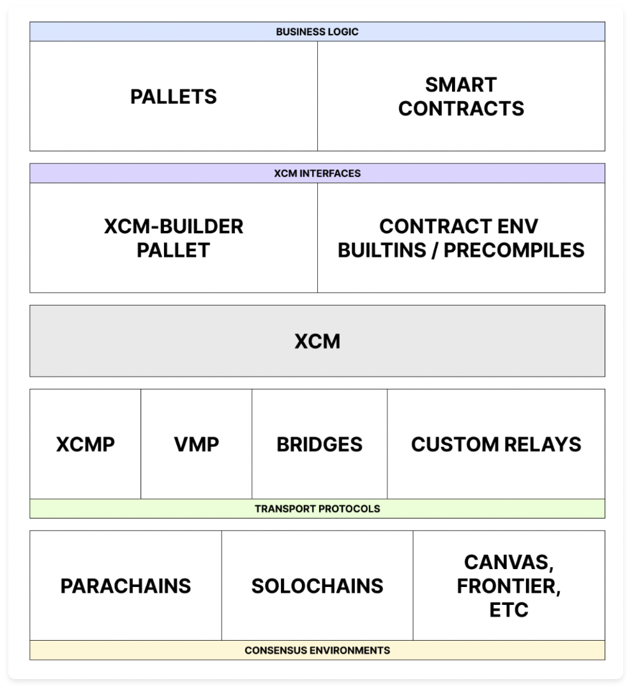
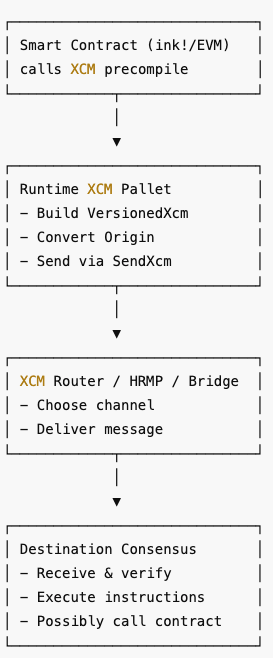
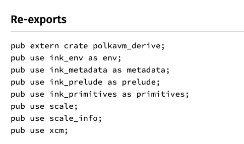

_Most D’Apps today live in isolation — fragmented across chains, reliant on fragile bridges, and unable to truly interoperate. On Polkadot hub, that changes with XCM, a Substrate-native technology that lets smart contracts talk to each other across different blockchains._


# Introduction


With the huge amount of D’apps (smart contract applications) available today, the most advantageous are the ones that allow easy interoperability between themselves and other distinct systems. On Polkadot, D’apps developed can easily interoperate with other D’apps on totally distinct chains using a Substrate-native technology called XCM. 


Consider a very common scenario, say you’ve deployed a DEX use-case on a chain like  Polygon and you’ve gained traction and lots of followers. If you wanted to also have your DEX usable by users on a new chain (say Ethereum), you would be hit with some headaches.

1. The various DEXes, even though are the same product, will have to standalone on their own (with fragmented liquidity and activities)
2. Rely on, vulnerable, bridges to move and use tokens across the different chains

These approaches are not the best solutions for DEXes and this situation is true for any other D’app.


 XCM (**Cross-Consensus Messaging)** was originally developed as a native way for parachains to communicate with each other. XCM is also exposed to smart contracts. This allows developers to use XCM from within their smart contracts and, therefore, be able to send messages between different contracts (regardless of where they are located). In this article, I’ll walk us through how XCM is exposed to smart contracts, and how developers can use it to execute cross-chain messages.


# How XCM works


To discuss XCM properly, we need to start with the Polkadot relay chain - a Layer-0 chain where other L1 chains (called parachains) can be deployed and these parachains benefit from its security, consensus and resources. One benefit of this architecture is native interoperability, without dependence on external bridges. This native interoperability is achieved using XCM.


XCM is strictly a messaging format (not a protocol) that defines the structure and behaviour of messages. XCM does not handle the delivery of the messages; this is handled by protocols such as XCMP (Cross-chain Message Passing) and VMP (Vertical Message Passing). It’s basically a set of instructions detailing what exactly the receiving consensus should do once the message is received. A well-detailed explanation of XCM and the common terms is documented on the [xcm-format docs](https://github.com/polkadot-fellows/xcm-format). Due to the design of XCM, as an agnostic message format, any consensus system can make use of XCM (not only Polkadot chains) to interoperate.


XCM is designed around the four ‘A’s, outlined as:

- _Asynchronous_: XCM messages in no way assume that the sender chain will be blocking on its completion.
- _Absolute_: XCM messages are guaranteed to be delivered and interpreted accurately.
- _Asymmetric_: XCM messages do not expect results and the consequence of the message must be communicated in a seperate message
- _Agnostic_: XCM messages do not make any assumptions about the nature of the systems where messages are being passed.

A blockchain can implement XCM using the [pallet-xcm](https://paritytech.github.io/polkadot-sdk/master/pallet_xcm/pallet/index.html) and this allows the chain to execute and send cross-chain messages. These XCM functionalities can then be exposed to smart contracts deployed on it. For instance, the Polkadot Hub chain exposes an [XCM precompile](https://paritytech.github.io/polkadot-sdk/master/pallet_xcm/precompiles/IXcm/index.html) that allows Solidity smart contracts to implement XCM without using a bridge.





A smart contract deployed on a Substrate chain (the chain naturally supports XCM) can use the XCM Precompile to send XCM messages across any consensus environment. Consensus environment, within XCM, could be referred to as **Location**. A Location can range from a Parachain ID to an addressable account (pretty much anything can be a Location). A smart contract deployed on Asset Hub can send an XCM message to transfer some assets to another contract deployed on Stellaswap and use these assets to perform some liquidity activities. This is just one use case for XCM and cross-chain swaps.


# XCM for Solidity, using the precompile


Parity maintains a list of precompile contracts to expose some Substrate native functionalities and one of them is the XCM precompile. This is a smart contract deployed to a certain address and can be interacted with by anyone as long as the interface is known.


The XCM precompile is deployed to the address **`0xA0000`** and its interface is known to be


```solidity
// SPDX-LicenseIdentifier: MIT
pragma solidity ^0.8.20;

interface IXcm {
	struct Weight {
		uint64 refTime,
		uint64 proofSize,
	}
	
	function execute(bytes calldata message, Weight calldata weight) external;
	
	function send(bytes calldata destination, bytes calldata message) external;
	
	function weighMessage(bytes calldata message) external view returns (Weight memory weight);
}
```


The interface is interesting and I will explain what these functions and arguments are all about. The interface has a type called _`Weight`_ and this is needed because we must pass the maximum weight of the message to the execute message as this is how XCM handles gas metering. Ideally, a developer would call `weighMessage`, to get the required weight. This weight would then be passed into subsequent messages (execute/send).


The XCM message is a byte of data, coined from a set of [XCM instructions](https://github.com/polkadot-fellows/xcm-format?tab=readme-ov-file#5-the-xcvm-instruction-set). Examples of how to generate this XCM message byte are written in Typescript [on this gist](https://gist.github.com/franciscoaguirre/a6dea0c55e81faba65bedf700033a1a2). Once a message is gotten and used to derive the weight, the weight alongside the message will then be sent to the execute message. for instance and this will execute (or consequently send) the XCM message.


**Execute message -** Runs an XCM message locally using the caller’s origin and is the main entry point to XCM interactions. For most use-cases, the execute message will suffice (whether to interpret XCM messages or actually try to send one). It expects the message bytes and the maximum weight (that can easily be derived from the `weighMessage`  call)


**Send message** - is rarely used (as the execute message suffices for most cross-chain operations). Send expects a **Location** and a message byte to dispatch XCM messages


## How to use the XCM precompile interface


Using the precompile can be done in 2 major ways:

1. Call the interface directly - using Remix or hardhat
2. Call the interface from another smart contract - as a library

### Direct calls


Using Remix (or even hardhat), it is possible to use the XCM precompile directly and execute XCM messages. This is a very straightforward process, possible in your browser, that involves the following steps:

1. Open the [Polkadot remix IDE](https://docs.polkadot.com/develop/smart-contracts/dev-environments/remix/)
2. Create a new file called IXcm.sol
3. Copy and paste the XCM precompile interface defined above
4. Compile the precompile interface
5. In the **Deploy & Run Transactions** tab, select the IXcm interface from the list of contracts
6. Ensure to deploy the contract to the precompile address (_0x00000000000000000000000000000000000a0000_)
7. Once deployed, you can then use the Remix IDE to call the functions. You can generate your own XCM message (use [the gist here](https://gist.github.com/bolajahmad/93f5aa9b8e4c534d1a257609dad54845)) or for quick testing, you can use my pre-generated message

> 💡 _Encoded message example, derived using the same gist shared above_  
> ```bash  
> 0x050c0004010000070088526a743001000002286bee31010100a10f0100000401000002286bee000400010204040d0102040001010078a6393ee5b1dbeb0d0a5df621aac8033aa5869a0baeee1a51ea52a7a920b438  
> ```


Using the precompile is very staightforward as we have seen here but it’s not the most optimal approach to XCM. In the ideal case, you will want to execute an XCM message from within your smart contract (e.g. a Staking contract or a DEX contract). This brings up to another way of using the precompile


### As a library


The precompile contract is technically a library and since we know both its interface and location (the deployment address), we can import it into our smart contract codebase (on hardhat for example) and then wrap the interface around the address.


The contract below is able to call the precompile library, let’s look at it


```solidity
// SPDX-License-Identifier: MIT
pragma solidity ^0.8.28;

/// Import the IXcm interface into our code
/// This assumes the code is located in a sinling directory called interface
import "./interface/IXcm.sol"; 

/// @dev The on-chain address of the XCM (Cross-consensus Messaging) precompileaddress 
constant XCM_PRECOMPILE_ADDRESS = address(0xA0000); // will prefix with 0s till the length is 20 bytes

contract XcmCaller {
	function teleportWithMessage(bytes memory message) external {
		IXcm xcm = IXcm(XCM_PRECOMPILE_ADDRESS);
		// weight the message 
		IXcm.Weight memory weight = xcm.weighMessage(message);
		// Now execute the message
		xcm.execute(message, weight);
	}
}
```


The function `teleportWithMessage` is the critical glue that makes this whole approach gel properly. One thing to note in this approach also is that, the message generation is done off-chain. At the time of this writing, the message generation is not quite possible using Solidity alone, for some reasons

1. The XCM message has to be SCALE-encoded, but Soldiity does not do SCALE
2. The process involves a lot of cascading code, which is not easy to handle using Soldiity
3. Substrate already exposes a number of functions that can help with the XCM message generation, these are not ready in Solidity.

The approach is then, to generate the XCM message bytes off-chain (Using Typescript/PAPI or Rust/Ink!). The gist shared above, is an example that used Typescript/ink! and is the focus of today (this is how a Frontend integration would use the contract after-all).


> 💡 N.B. When using the `library` approach, it is important that the smart contract has enough funds to pay for the gas fees, or you might encounter some problems.


### Under the hood:

1. XCM message triggered by a smart contract calls the XCM precompile (which is some Rust code that is tied into the runtime of the host chain). This precompile then forwards the message to the chain’s Runtime XCM Executor
2. The runtime will then wrap the message in a Transact/SendXcm instruction and also transform its origin to the proper MultiLocation format. The transformed message is then queued into the XCM queue of the runtime
3. The message will then be transported, using the appropriate message protocol
    - If the destination is another parachain, then it will use the XCMP/HRMP route
    - If the destination is the relay chain, it used the VMP route
4. Once teh destination receives the message, it will decode it and execute the message. If there is a response action, it will also be sent in the same way the original sender sent the message.

The Runtime then builds the instruction set, and queues





# Generating the XCM message byte


A very crucial aspect of the cross-chain interaction involves generating the XCM message byte. The message byte is a SCALE-encoded set of instructions and it usually starts with the XCM Version. XCM messages are versioned and it’s very important to understand the version of the message you’re trying to send. The XCVM (XCM Virtual Machine) register documents a list of Instruction sets available and this is updated per XCM versions. In the examples we have defined above, we used an off-chain TS script to generate our message. There’s no harm in this, and invalid messages will fail so you can be sure about your message. But in some cases, you might want to generate the XCM message on-chain. But I specified that doing the XCM message using Solidity is not the best approach. What we can do is introduce an on-chain contract, written in ink! to generate the message byte and then pass the message byte into our solidity function.


I have shown the approach of using a Typescript file so the focus is now on using an ink contract. The [ink crate](https://use-ink.github.io/ink/ink/) exposes an xcm crate and this can be used to compose and encode the xcm message





From within our Solidity contract, we can call our ink library to generate the XCM message and then pass the response into our execute and weighMessage messages. An example of how to buuld the XCM message is written below and can also be found on [this gist](https://gist.github.com/bolajahmad/93f5aa9b8e4c534d1a257609dad54845#file-xcm-ink-library-rs).


```rust
#[ink(message)]        
pub fn teleport(&self, para_id: u32, beneficiary: Bytes32, amount: u128) -> Bytes {            
	let destination = Location::new(1, [Parachain(para_id)]);  // get the Location of the dest          
	let remote_fees = AssetTransferFilter::Teleport(
		Definite((Parent, amount.saturating_div(10)).into())
	); // How much fees to pay
	
	let preserve_origin = false;            
	// build the asset to transfer
	let mut transfer_assets = Vec::new();            
	transfer_assets.push(AssetTransferFilter::Teleport(Wild(AllCounted(1))));            
	
	let remote_xcm = Xcm::<()>::builder_unsafe()                
		.deposit_asset(AllCounted(1), *beneficiary)                
		.build();            
		
	// Build the XCM instruction set
	let xcm = Xcm::<()>::builder()                
		.withdraw_asset((Parent, amount))    // Start a native withdrawal of specified amount          
		.pay_fees((Parent, amount.saturating_div(10))) // dedicate some amount to pay fees
		.initiate_transfer(  // do the actual transfer                  
			destination,                    
			remote_fees,                    
			preserve_origin,                    
			transfer_assets,                    
			remote_xcm                
		).build();            
		
	let versioned = VersionedXcm::from(xcm);            
	ink::sol::DynBytes(versioned.encode())  // return the message byte      
}
```


Within our Solidity contract, we can then interact with this ink library by defining an interface and the deployment address of the ink library. The updated smart contract will then look like this,


```solidity
interface IInkXcmLibrary {
	function teleport(uint32 paraId, bytes32 beneficiary, uint128 amount) external returns (bytes memory);
}

address constant INK_LIBRARY_ADDRESS = 0x057933793F86a32d646ef8183438a38f514DD99F;

contract XcmCaller {
	function teleportAsset(uint32 chainId, bytes32 beneficiary, uint256 amount) external {
		bytes memory message = IInkXcmLibrary(INK_LIBRARY_ADDRESS).teleport(
			chainId,
			beneficiary,
			amount
		);   /// Generate the XCM message here, using the Ink! library
		...
	}
}
```


One thing to note here is that, we are using our Solidity contract to directly interact with our ink! contract and that is what we use to generate the message. Naturally, ink contracts are SCALE-encoded while Solidity contracts are ABI-encoded so this won’t just work out-of-the-box.


So what we do is, we configure our ink contract to output its metadata as ABI-format and this is what allows the Solidity contract to call the ink! library. To do this, make sure the _`Cargo.toml`_ of the ink contract outputs the metadata as ABI.


```toml
...

[package.metadata.ink-lang]
abi = "sol"

...
```


This approach is an on-chain approach to generating the XCM message bytes, while using the Typescipt approach does this off-chain. Either one is fine, but the off-chain approach is obviously more error prone (needs the byte to be copied and sent around, might get compromised in the process)


# Conclusion


XCM is the cross-chain interoperability approach that Polkadot parachains use to communicate between each other. A parachain can expose some level of its native functionality to a smart contract (deployed on it) using Precompiles and one of these is the XCM precompile which allows smart contracts to execute and send XCM messages. This makes XCM very much available and fully functional within the Polkadot Hub environment.


The XCM precompile is a Rust code that has been deployed a the specific address 0xA0000) and has a specific interface that allows the messages `execute,` `send` and `weighMessage`. A smart contract developer has the option of just using the precompile directly, or writing as many custom logic and calling the precompile from another contract (as a library). Developers also have the choice of generating the XCM message off-chain (using Polkadot API) or on-chain (using another ink contract).


The full solidity smart contract code is available [here](https://gist.github.com/bolajahmad/93f5aa9b8e4c534d1a257609dad54845) for better read and practice. For a deeper understanding of how XCM works and all related parts, the [XCM docs](https://docs.polkadot.com/develop/interoperability/intro-to-xcm/) is a great docs.
